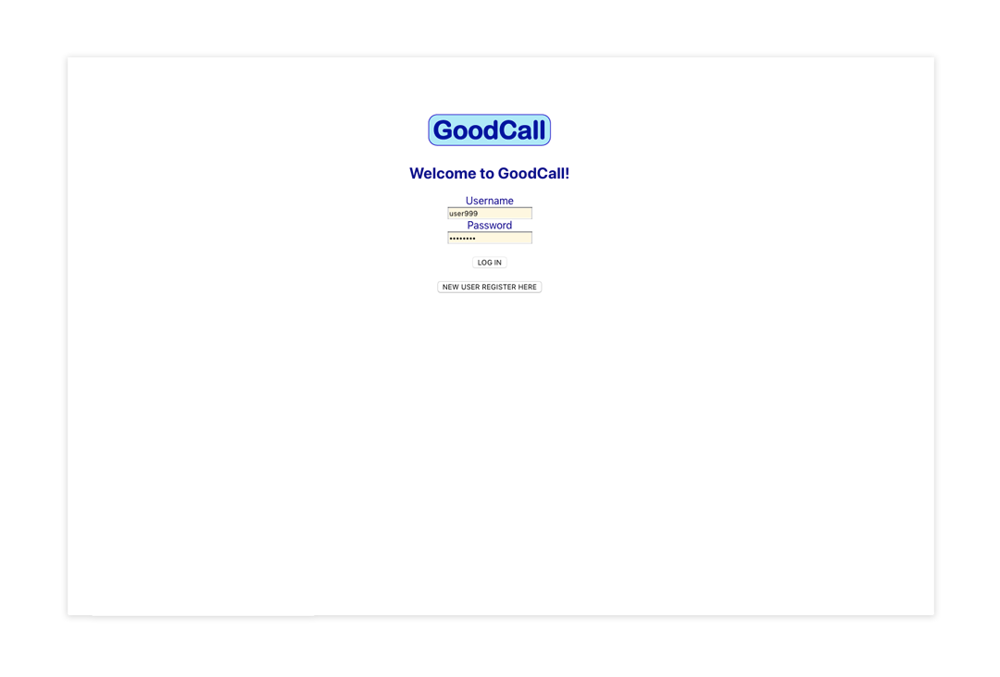
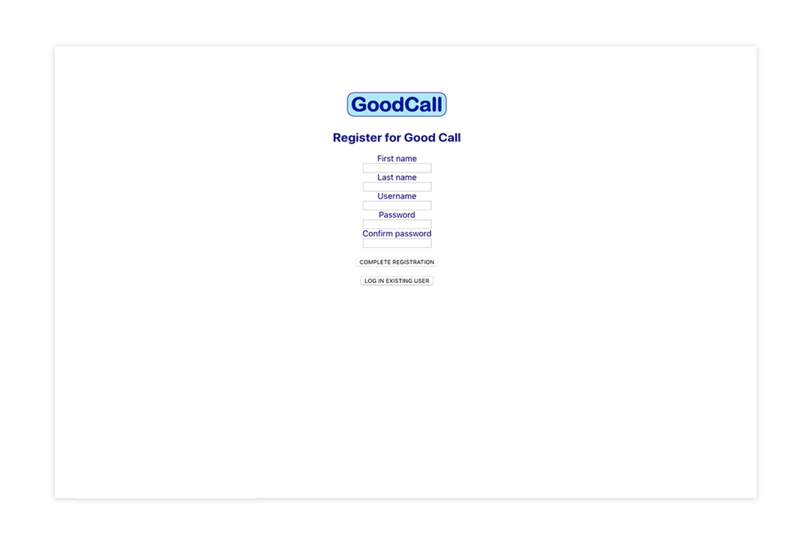
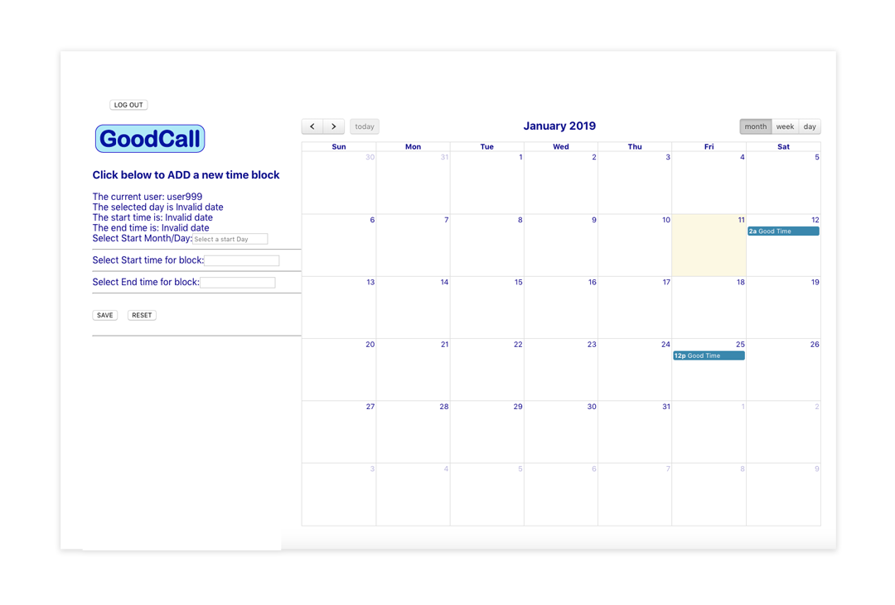
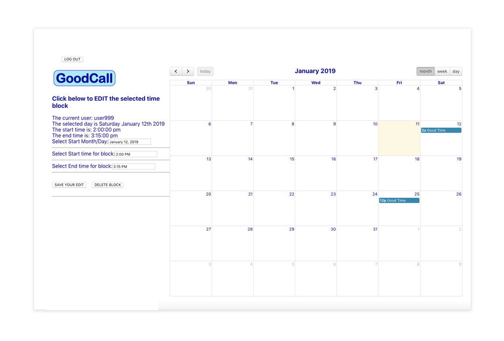

# GoodCall
In the dark and distant past when landlines were the norm, the appropriate time to call someone seemed more apparent but with the advent of mobile phones and more diverse work schedules that 'good' time to call a person has become harder to discern. Combine that with the alluring and intoxicating ability to call other time zones and the problem both escalates and becomes more complex. All this amazing technology but still that paralyzing question, when is a good time to call? Enter the 'goodCall' app, providing a simple way to have a 'friends and family' group communicate their individual call time schedules to each other and help match up times when it is best for both parties to talk based on a comparison of individual schedules. Hopefully the simple knowledge of knowing when a person is available to talk will result in more robust communication amongst groups. 

See a demo here: https://goodcall.herokuapp.com/

## Base Project Goal
GoodCall is intended to help a user keep track of the good times to call people.

## Current Functionality:
GoodCall allows the creation of users and then allows for secure log-in of existing users.
As a user you can currently set time block events with a day/date and a start and end time via a calendar.
Exisitng time blocks can then be freely editied and deleted.
These blocks are stored in your secure user account.

## Screenshots:

## User Log-in:

## New User Registration:

## User Schedule View (Add Time Blcok Mode):

## User Schedule View (Edit Time Blcok Mode):

## Future Functionality
Allow users to add themselves to a user group wherein they can share schedule information.
This would allow viewable comparisons of a user schedule with that of his or her user group.   

